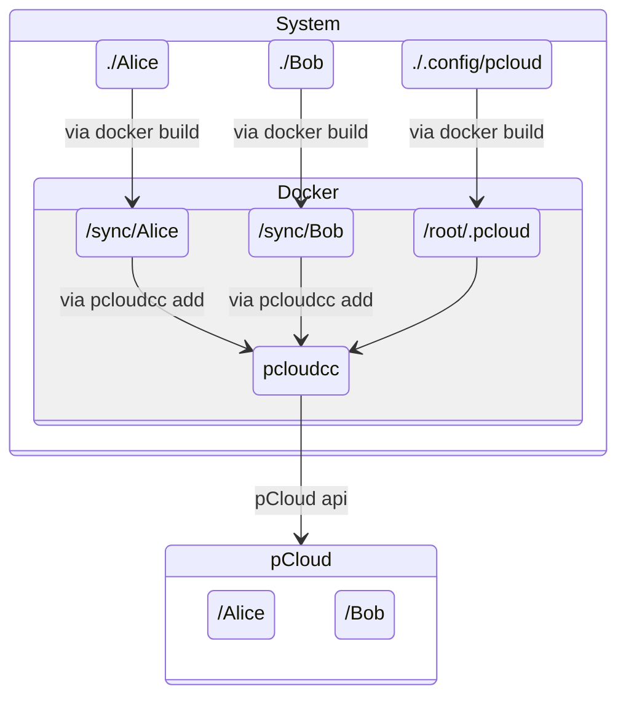

# PcloudccDocker

<div align="center">

  
  [](https://docs.docker.com/engine/install "Link to web page")


</div>

This repository enables the simple creation of a two-way synchronization of one or more folders between Linux and [pCloud](https://www.pcloud.com/). The implementation as a Docker container provides an encapsulated and easy-to-manage environment. There are no restrictions when using Windows, but the examples shown here only cover Linux. In addition to the folders to be synchronized, only a single configuration folder is required. Operation is fully automatic, but setup and login are not. For this reason, a means of interacting with the container is necessary. SSH access or another means of interaction is required.

## Versions

The pCloud API was published in the repository [pcloudcom/console-client](https://github.com/pcloudcom/console-client). The last changes were made more than 5 years ago when this repository was launched. The repository [lneely/pcloudcc-lneely](https://github.com/lneely/pcloudcc-lneely), which is also used here, is a continuation of the project. The Dockerfile downloads the latest repository from pcloudcc-lneely with each build and compiles it. This ensures that the latest changes and security updates are always used. As a result, new changes may break the Docker container.

## License

The pCloud APIs have been published with the license [`BSD 3-Clause "New" or "Revised" License`](https://spdx.org/licenses/BSD-3-Clause.html) in the repository [pcloudcom/console-client](https://github.com/pcloudcom/console-client).

## Example

The following example shows how to set up two different folders on the system so that they are synchronized with the cloud. This assumes that the folders `Alice` and `Bob` exist in the cloud. All other settings are carried out step by step on the system. The figure shows how the individual folders interact.



Three folders are required on the system: two that are synchronized and one for configuration. A Docker container without volumes or mounts does not retain any data after termination. The paths in the example can be freely selected and thus customized.

```bash
mkdir -p "./Alice"
mkdir -p "./Bob"
mkdir -p "./.config/pcloud"
```

Next, the Docker container must be built. The easiest way to do this is in the folder where the `Dockerfile` is located, i.e., directly in the cloned repository. If a different folder is used, the path to the `Dockerfile` must be specified.

```bash
docker build -t chris82111/pcloudccdocker:260208 .
```

The container itself is created based on the image, which is why adjustments need to be made here. Enter your own email address here instead of `Example@example.com`:

```bash
docker container create -it --name pcloudccContainer \
  --user $(id -u):$(id -g) \
  --mount type=bind,source="$(pwd)/Alice",target="/sync/Alice" \
  --mount type=bind,source="$(pwd)/Bob",target="/sync/Bob" \
  --mount type=bind,source="$(pwd)/.config/pcloud",target="/home/ubuntu/.pcloud" \
  --device /dev/fuse --cap-add SYS_ADMIN --security-opt apparmor:unconfined \
  --restart always  \
  --env EMAIL='Example@example.com' \
  chris82111/pcloudccdocker:260208
```

The container must then be started:

```bash
docker start pcloudccContainer
```

Connect to a running container to execute commands:

```bash
docker exec -it pcloudccContainer bash
```

Log in with the following command:

```bash
PCLOUD_REGION_EU=true pcloudcc -u "${EMAIL}" -p -s
```

The program will prompt you to enter your password. If everything worked, you will see the following output. After entering the password, you can end the login by pressing the two keys "Ctrl" + "c" simultaneously:

```bash
Down: Everything Downloaded| Up: Everything Uploaded, status is LOGIN_REQUIRED
logging in
event 1234567890
event 1234567890
Down: Everything Downloaded| Up: Everything Uploaded, status is SCANNING
Down: Everything Downloaded| Up: Everything Uploaded, status is READY
```

Once you have entered your password and everything works, then you can run pcloudcc as a background daemon. 

```bash
    PCLOUD_REGION_EU=true pcloudcc -u "${EMAIL}" -d
```

To display which folders are currently being synchronized, enter the following command:

```bash
    printf "s ls\nq\n" | script -q -c "pcloudcc -k" /dev/null
```

During initial setup, no folders will be set up for synchronization. You will see the text `No folders are set up for synchronization.` To add folders, use the following commands. The `sync` folder is inside the container, the second parameter is the folder in the cloud:

```bash
    
    printf "s add \"/sync/Bob\" \"/Bob\"\nq\n" | script -q -c "pcloudcc -k" /dev/null
```

You can check whether the folders have been added successfully:

```bash
    printf "s ls\nq\n" | script -q -c "pcloudcc -k" /dev/null
```

Once everything is set up, you can leave the container:

```bash
    exit
```

From now on, everything will be done automatically each time the container is started. Starting and stopping the container starts and stops synchronization.

## List of commands

### Commands on the system

These commands are used to interact with Docker on the system.

- Start container: \
  `docker start pcloudccContainer`
- Stop container: \
  `docker stop pcloudccContainer`  
- Status of all containers: \
  `docker ps`  
- Log into container: \
  `docker exec -it pcloudccContainer bash`  
- Stop and remove container: \
  `docker stop pcloudccContainer ; docker rm pcloudccContainer`

### Commands in the container

These commands are used in the container to access the background process.

- Help output: \
  `printf "?\nq\n" | script -q -c "pcloudcc -k" /dev/null` |
- Stop background process: \
  `printf "f\n" | script -q -c "pcloudcc -k" /dev/null` |
- Interactive mode with background process: \
  `pcloudcc -k`  
- Listing synchronized folders: \
  `printf "s ls\nq\n" | script -q -c "pcloudcc -k" /dev/null`
- Add folders to synchronization: \
  `printf "s add \"/sync/Alice\" \"/Alice\"\nq\n" | script -q -c "pcloudcc -k" /dev/null`
- Leave the container: \
  `exit`
