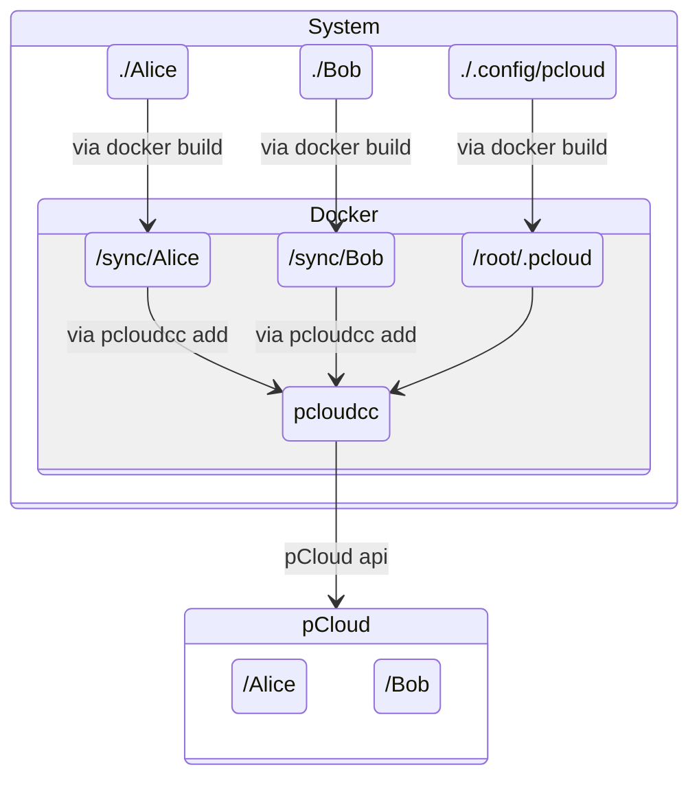

# PcloudccDocker

<div align="center">

  
  [](https://docs.docker.com/engine/install "Link to web page")


</div>

This repository enables the simple creation of a two-way synchronization of one or more folders between Linux and [pCloud](https://www.pcloud.com/). The implementation as a [Docker](https://docs.docker.com/) container provides an encapsulated and easy-to-manage environment. There are no restrictions when using on Windows with WSL, but the examples shown here only cover Linux. In addition to the folders to be synchronized, only a single configuration folder is required. Operation is fully automatic, but setup and login are not. For this reason, a means of interacting with the container is necessary. SSH access or another means of interaction is required. A container must be created for each cloud. If data from a cloud is also synchronized with different Linux users, a container should be created for each user to synchronize their data.

## Versions

The pCloud API was published in the repository [pcloudcom/console-client](https://github.com/pcloudcom/console-client). The last changes were made more than five years ago when this repository was launched. The repository [lneely/pcloudcc-lneely](https://github.com/lneely/pcloudcc-lneely), which is also used here, is a continuation of the project. The Dockerfile downloads the latest version from pcloudcc-lneely with each build and compiles it. This ensures that the latest changes and security updates are always used. As a result, new changes may break the Docker container.

## Docker Requirements

Before compiling the Dockerfile, it is advisable to check that all Docker settings are correct.

1. The following command displays the current version of Docker; no special permissions are required. If the command generates an error, Docker is not installed and must be installed.
   
   ```bash
   docker --version
   ```

2. The following command provides information about the currently running Docker containers. To execute it, the current user must belong to the `docker` group or execute the subsequent commands with `sudo` privileges.

   ```bash
   docker ps
   ```

   The successful output contains at least the heading and all running images below it.

   ```bash
   CONTAINER ID  IMAGE  COMMAND  CREATED  STATUS  PORTS  NAMES
   ```

   The incorrect output may look like this.

   ```bash
   Got permission denied while trying to connect to the Docker daemon socket at unix:///var/run/docker.sock: Get "http://%2Fvar%2Frun%2Fdocker.sock/v1.24/containers/json": dial unix /var/run/docker.sock: connect: permission denied
   ```

3. Alternatively, a group can be created and the current user added to that group, eliminating the need to use sudo for subsequent commands. Membership in the docker group is essentially root-equivalent access, so treat the docker group as trusted users only. Depending on your system, you must select one of the following:

   1. Standard Linux system   

      ```bash
      sudo groupadd -f docker
      sudo usermod -aG docker "${USER}"
      ```

   2. The following commands must be used on a [Synology](https://www.synology.com/en-uk) system.

      ```bash
      sudo synogroup --add docker
      sudo chown root:docker /var/run/docker.sock
      sudo synogroup --memberadd docker "${USER}"
      ```

4. Now you must log out and log back in, for the changes to take effect.

## Example

The following example shows how to set up two different folders on the system so that they are synchronized with the cloud. This assumes that the folders `Alice` and `Bob` exist in the cloud. A recommendation: if data from different users is synchronized, one container should synchronize the data from one user at a time. All other settings are carried out step by step on the system. The figure shows how the individual folders interact.



It is best to start in a folder where you want to try out the example. Change to any directory. You can clone the repository and change to the downloaded folder, or you can download the necessary files ([Dockerfile](./Dockerfile), [entrypoint.sh](./entrypoint.sh), and [.dockerignore](./.dockerignore)).

Three folders are required on the system: two that are synchronized and one for configuration. A Docker container without volumes or mounts does not retain any data after termination. The paths in the example can be freely selected and thus customized.

```bash
mkdir -p "./Alice"
mkdir -p "./Bob"
mkdir -p "./.config/pcloud"
```

Next, the Docker container must be built. The easiest way to do this is in the folder where the [Dockerfile](./Dockerfile) is located, i.e., directly in the cloned repository. If a different folder is used, the path to the Dockerfile must be specified.

A parameter mentioned here, `--build-arg TAG=""`, can be used to select a specific version of the repository. An empty or missing parameter selects the latest version.

If multiple pCloud accounts are to be synchronized on one system, the commands must be executed for each user.

The parameter `SETUID_ROOT` can be set to true; the default is false. This starts the process with admin rights, which allows files to be uploaded by any user (including root data, which can pose a risk; pay attention to the folder that is mounted). However, this is the only way to synchronize a folder that was created by root, as with shared folders on Synology. Downloaded data is assigned root as the owner and the selected user as the group (If this is a problem, then it must be changed in the source code of pcloudcc). The data can therefore still be read by the user. On systems with a graphical user interface, e.g., Ubuntu, the files are marked with an 'x', which is graphically unattractive. However, they can be used normally.

To ensure that the latest version is used, the system should be cleaned of old images or the `--no-cache` option should be used.

The synchronization can run under two different user contexts; (1) as the current user, or (2) as another user.

1. Depending on which user the synchronization is to be set up for, the parameters must be set differently. If we set up synchronization for the current user, the following command can be used. The subsequent container can then only synchronize the user's data. Perfect for a local user, e.g., a computer running [Ubuntu](https://ubuntu.com/desktop) like option (1):

   ```bash
   docker build --build-arg UID=$(id -u) --build-arg GID=$(id -g) --build-arg SETUID_ROOT=false -t chris82111/pcloudccdocker .
   ```

2. Alternatively, synchronization can be set up for another user as in option (2). The user ID `UID` and group ID `GID` must be set correctly, but are determined automatically by specifying the user name. The ID can also be set to 0 (root), but then the name must also be specified: `--build-arg USE_USER=root`.

   Set user name:

   ```bash
   FOR_USER="ubuntu"
   ```

   Checks whether the user has access to the current directory:

   ```bash
   id "${FOR_USER}" && sudo -u "${FOR_USER}" sh -c 'test -r . && test -w . && test -x .' && echo "ok" || echo "error"
   ```

   Creates the container:

   ```bash
   id "${FOR_USER}" && docker build --build-arg UID=$(id -u "${FOR_USER}") --build-arg GID=$(id -g "${FOR_USER}") --build-arg SETUID_ROOT=true -t chris82111/pcloudccdocker .
   ```

   Depending on the application, it may be necessary to adjust the rights accordingly. Changes the owner of the created folders:

   ```bash
   id "${FOR_USER}" && 
   sudo chown $(id -u "${FOR_USER}"):$(id -g "${FOR_USER}") "./Alice" &&
   sudo chown $(id -u "${FOR_USER}"):$(id -g "${FOR_USER}") "./Bob" &&
   sudo chown $(id -u "${FOR_USER}"):$(id -g "${FOR_USER}") "./.config" &&
   sudo chown $(id -u "${FOR_USER}"):$(id -g "${FOR_USER}") "./.config/pcloud"
   ```

Before the next command, an old container should be removed. An error message stating that the container cannot be found can be ignored.

```bash
docker stop pcloudccContainer && docker rm pcloudccContainer
```

The container itself is created based on the image, which is why adjustments need to be made here. Enter your own email address here instead of `Example@example.com`:

```bash
docker container create -it --name pcloudccContainer \
  --mount type=bind,source="$(pwd)/Alice",target="/sync/Alice" \
  --mount type=bind,source="$(pwd)/Bob",target="/sync/Bob" \
  --mount type=bind,source="$(pwd)/.config/pcloud",target="/home/ubuntu/.pcloud" \
  --device /dev/fuse --cap-add SYS_ADMIN --security-opt apparmor:unconfined \
  --restart always  \
  --env EMAIL='Example@example.com' \
  chris82111/pcloudccdocker
```

The container must then be started:

```bash
docker start pcloudccContainer
```

Connect to a running container to execute commands:

```bash
docker exec -it pcloudccContainer bash
```

Before setting up pCloud, the settings of the folders mounted in the container can be checked.

1. The permissions must be at least `drw-------` for two-way synchronization to work. If this is not the case, the user's permissions on the host system must be adjusted. Please note that changes will only be updated after you log out and log back in again. So, stop the container, log out, log back in, and start the container. The permissions should then be updated. 

2. Another problem may occur if the owner of the folder does not match. The problem has been seen on a Synology with a customized ACL. Make sure that the user matches. 

```bash
ll /sync/
```

- A working output might then look like this:

  ```bash
  # drwxrwxrwx 1 ubuntu user 0 Feb 21 21:21 Alice/
  # drwxrwxrwx 1 ubuntu user 0 Feb 21 21:21 Bob/
  ```

  The following outputs, where the user does not match, can be problematic. pcloudcc will then be unable to add the folder for synchronization:

  ```bash
  # drwxrwxrwx 1 1026   user 0 Feb 21 21:21 Bob/
  ```

  ```bash
  # drwxrwxrwx 1 root   root  28 Feb 21 21:12 Bob/
  ```

Log in to pCloud with the following command:

```bash
PCLOUD_REGION_EU=true pcloudcc -u "${EMAIL}" -p -s
```

The program will prompt you to enter your password. If everything worked, you will see the following output. After entering the password, you must end the login by pressing the two keys "Ctrl" + "c" simultaneously to proceed:

```bash
Down: Everything Downloaded| Up: Everything Uploaded, status is LOGIN_REQUIRED
logging in
event 123456789a
event 123456789a
Down: Everything Downloaded| Up: Everything Uploaded, status is SCANNING
Down: Everything Downloaded| Up: Everything Uploaded, status is READY
```

- Error messages may be displayed when exiting. The pcloudcc application creates a directory in the home directory (`ubuntu`) that contains a complete copy of the cloud. The results vary depending on the kernel. With a kernel 6.x, there were no error messages and no content in the directory. With a 3.x, there was data in the directory and the following message:

  ```bash
  fuse: reading device: Bad file descriptor  
  ubuntu@123456789abc:/sync$ fusermount: /home/ubuntu/pCloudDrive not mounted  
  ```

  Or just an empty directory with the following message:

  ```bash
  fusermount: user has no write access to mountpoint /home/ubuntu/pCloudDrive
  Down: Everything Downloaded| Up: Everything Uploaded, status is READY
  fusermount: user has no write access to mountpoint /home/ubuntu/pCloudDrive
  ```

Once you have entered your password and everything works, then you can run pcloudcc as a background daemon. 

```bash
PCLOUD_REGION_EU=true pcloudcc -u "${EMAIL}" -d
```

To display which folders are currently being synchronized, enter the following command:

```bash
printf "s ls\nq\n" | script -q -c "pcloudcc -k" /dev/null
```

During initial setup, no folders will be set up for synchronization. You will see the text `No folders are set up for synchronization.` To add folders, use the following commands. The `sync` folder is inside the container, the second parameter is the folder in the cloud:

```bash
printf "s add \"/sync/Alice\" \"/Alice\"\nq\n" | script -q -c "pcloudcc -k" /dev/null
printf "s add \"/sync/Bob\" \"/Bob\"\nq\n" | script -q -c "pcloudcc -k" /dev/null
```

- If something is wrong, a drive can be removed. To do this, list the drives and find the corresponding folder ID with:

  ```bash
  printf "s ls\nq\n" | script -q -c "pcloudcc -k" /dev/null
  ```

  The drive can be removed using the following command with the ID. Replace the ID 123456789ab with your displayed ID:

  ```bash
  printf "s rm 123456789ab\nq\n" | script -q -c "pcloudcc -k" /dev/null
  ```

You can check whether the folders have been added successfully:

```bash
printf "s ls\nq\n" | script -q -c "pcloudcc -k" /dev/null
```

Once everything is set up, you can leave the container:

```bash
exit
```

From now on, everything will be done automatically each time the container is started. Starting and stopping the container starts and stops synchronization.

The status of the container and others can be checked with the following command. The status of the container is only updated every 30 seconds, so it may take a while for the changes to become visible. As long as a background process `pcloudcc` exists, the status is Healthy.

```bash
docker ps
```

The following command can be used to check how much storage space is being used by Docker:

```bash
docker system df
```

To free up storage space, the following command can be used to release only unused (dangling) resources. The additional parameter `-a` removes all unused images.

```bash
docker system prune
```

Deleting is particularly important because the individual steps involved in creating the image are cached. If the image is recreated, no new code is downloaded from GitHub. Even if a new image is created years later, the old version is used without retrieving the latest changes.

## List of commands

### Commands on the system

These commands are used to interact with Docker on the system.

- Start container: \
  `docker start pcloudccContainer`
- Stop container: \
  `docker stop pcloudccContainer`  
- Status of all containers: \
  `docker ps`  
- Log into container: \
  `docker exec -it pcloudccContainer bash`  
- Stop and remove container: \
  `docker stop pcloudccContainer && docker rm pcloudccContainer`

### Commands in the container

These commands are used in the container to access the background process.

- Help output: \
  `printf "?\nq\n" | script -q -c "pcloudcc -k" /dev/null` |
- Stop background process: \
  `printf "f\n" | script -q -c "pcloudcc -k" /dev/null` |
- Interactive mode with background process: \
  `pcloudcc -k`  
- Listing synchronized folders: \
  `printf "s ls\nq\n" | script -q -c "pcloudcc -k" /dev/null`
- Add folders to synchronization: \
  `printf "s add \"/sync/Alice\" \"/Alice\"\nq\n" | script -q -c "pcloudcc -k" /dev/null`
- Leave the container: \
  `exit`

## License

The pCloud APIs have been published under the license [BSD 3-Clause "New" or "Revised" License](https://spdx.org/licenses/BSD-3-Clause.html) in the repository [pcloudcom/console-client](https://github.com/pcloudcom/console-client).
